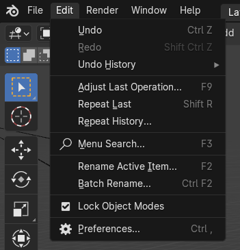
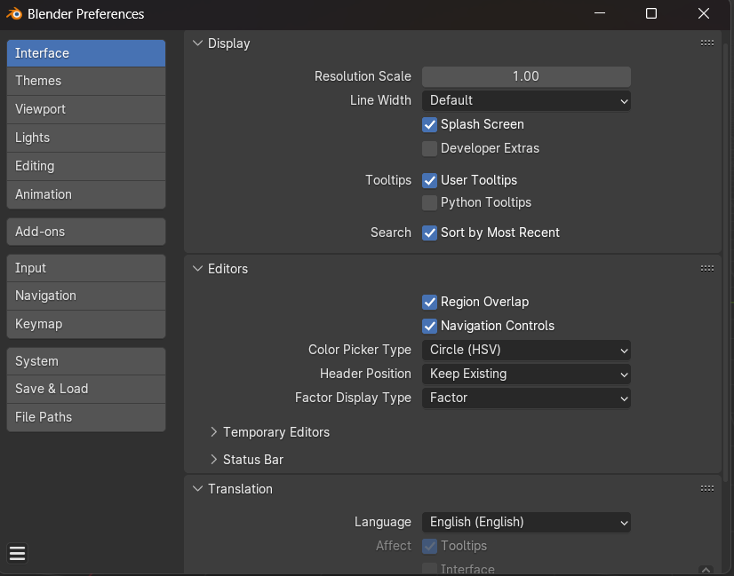
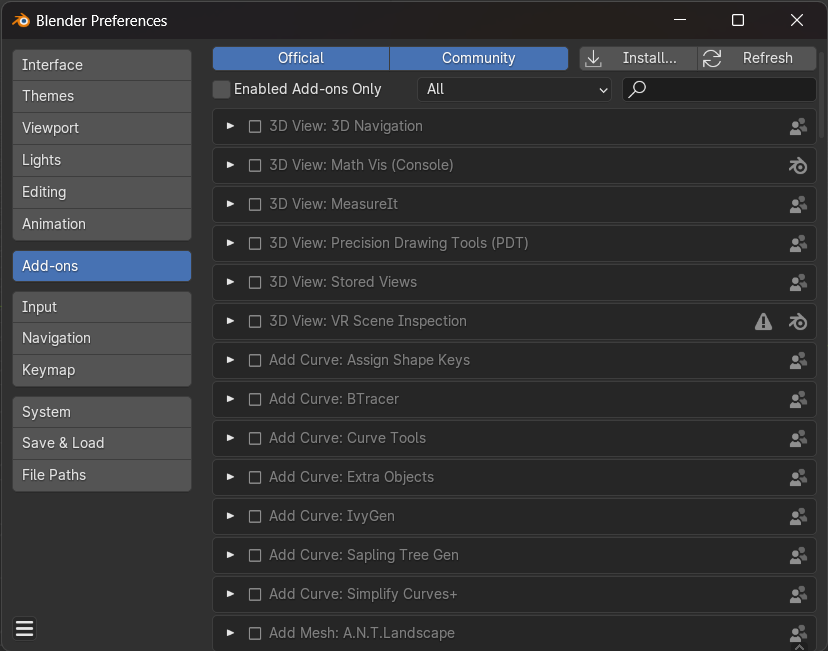
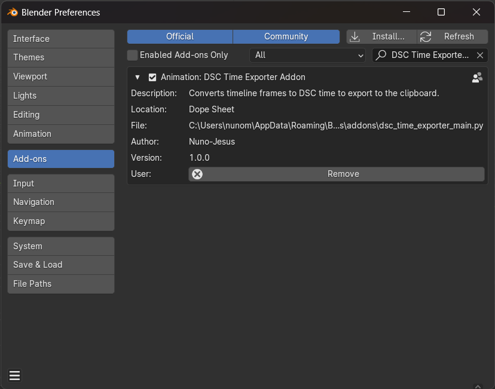
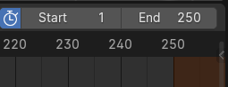
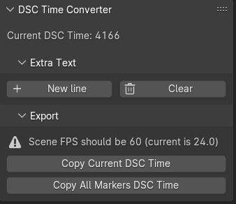

# **Installation**

## 🧬 **1 - Cloning**

Clone the repository into your machine:

```shell
git clone https://github.com/Nuno-Jesus/blender-dsc-time-exporter.git
```

> [!NOTE]
> If you want to give a name into the folder, you can specify the name as an extra parameter, like so: `git clone https://github.com/Nuno-Jesus/blender-dsc-time-exporter.git name_of_the_folder`

## ⚙️ **2 - Uploading to Blender**

**2.1.** Open Blender, navigate to the `Edit` tab and select the `Preferences` option:



A window like this should be rendered:



**2.2** Navigate to the `Add-ons` tab and click on `Install`



You should now search for the folder that has this repository cloned and select the `dsc_time_exporter_main.py` file. Click on `Install Add-on` and the module will be imported.

**2.3** If you search for "dsc", you should now see a new entry on the add-on list. Make sure you toggle the checkbox to activate the plugin.



## ✅ **3 - Final checks**

If all went smoothly, you should now see a new panel on the right side of the timeline. Proceed to click on the small arrow on the right, just under the scroll bar:



The new panel, called `DSC Time Converter` should now be visible.

