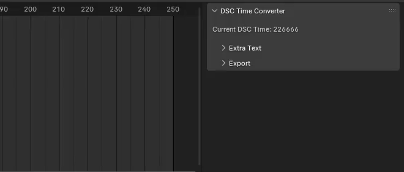
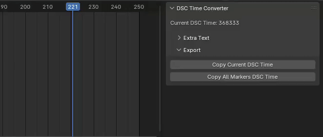

# **DSC Time Exporter**
A Blender 4.0.2 add-on. Provides the ability to convert the Blender frames to [Project Diva](https://store.steampowered.com/app/1761390/Hatsune_Miku_Project_DIVA_Mega_Mix/) timestamps.

## 📝 **Authorship**
Although the code is of my authorship, I need to thank [ThisIsHH](https://github.com/ThisIsHH) for exploring this sort of tool earlier. From what he achieved, I was able to re-work it and build on top of that.

## 📒 **About**
This repo houses a Blender add-on designed to help Project Diva modders. The add-on automatically maps a frame number from Blender to a Diva Script timestamp. Diva Script or DSC as I'll use from now on, is the file extension for Project Diva scripts.

## 🕹️ **Features**
The current section will explain what the add-on has to offer.

- ### **Display the current DSC Time**
Depending on the frame you're on, the main panel will display the current DSC timestamp. 

> [!WARNING]
> The calculation is done based on the Blender scene current FPS. Different FPS will output different timestamps.

<div align=center>
	
</div>

- ### **Export the current DSC Time**
The second subpanel has 2 buttons. Click on the `Copy Current DSC Time` button to copy the current frame DSC timestamp.

<div align=center>
	
</div>

You'll notice the video above shows a lot more on the clipboard than just the timestamp. The default output is something like this:

```py
TIME(...) 			# This is where the DSC timestamp will be placed
CHANGE_FIELD(...)	# This is a counter ranging from 1 to n (default value is 1)
MOVIE_DISP(1)
MOVIE_PLAY(1)
DATA_CAMERA(0, 1)
```

If you don't feel like having all these commands, you might want to change the source code. More info [here](#👨🏻‍💻-changing-source-code).

- ### **Export all timeline markers DSC Time**
Need to export several frames? Using timeline markers, you can mark multiple frames. Then, click on `Copy All Markers DSC Time` button to convert and export them all.

<div align=center>
	
</div>

- ### **Append extra lines to the output**
If you are in dire need of extra output, you can explore the `Extra Text` subpanel. From there, you can add as many lines as you need. You can also remove some or all lines if not needed anymore. Keep in mind the new lines will be appended to the end of the default text, as a suffix.

<div align=center>
	
</div>

## 👨🏻‍💻 **Changing Source Code**
If you're not feeling comfortable with the add-on output, you can change it and it's not that hard! On the `dsc_time_exporter_main.py`, look for this function:

```py
def stringify_marker(dsc_time: int, i: int=1):
	return f'TIME({dsc_time});\n' + \
		f'CHANGE_FIELD({i});\n' + \
		'MOVIE_DISP(1);\n' + \
		'MOVIE_PLAY(1);\n' + \
		'DATA_CAMERA(0, 1);\n'
```

The `dsc_time` parameter is what you're looking for. Supposing you only want this, the new code should look like this:

```py
def stringify_marker(dsc_time, i=1):
	return f'{dsc_time}\n'
```

Please, **keep the** `\n` **so line breaks are applied**!

## 🔁 **Further Updates**
I don't have any planed updates. However, if you feel like something could be changed, don't hesitate to create an issue! Feel free to also create a Pull Request in case you have an update yourself!

## 📚 **Resources**
- [Blender API](https://docs.blender.org/api/current/index.html)
